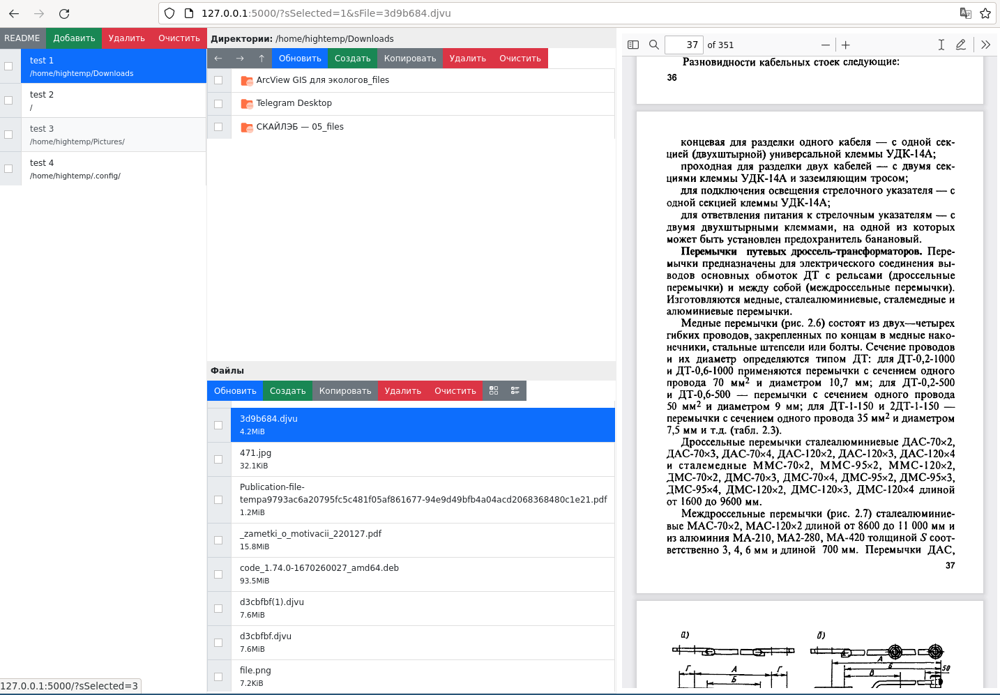

# wapp_file_manager

Файловый менеджер на flask. 

- Есть просмотр изображений
- Подсветка кода тестовых файлов
- Есть просмотр PDF
- Есть просмотр DJVU с конвертацией в PDF



## Запуск

```bash
python3 v0.3.2.1671742104.zip
# или
python3 __main__.py
```

## Упаковка

```bash
# https://docs.python.org/3/library/zipapp.html
python3 -m zipapp wapp_file_manager -p "/usr/bin/env python3"
```

## Зависимости

- apt пакеты
    - djvulibre-bin
    - unoconv